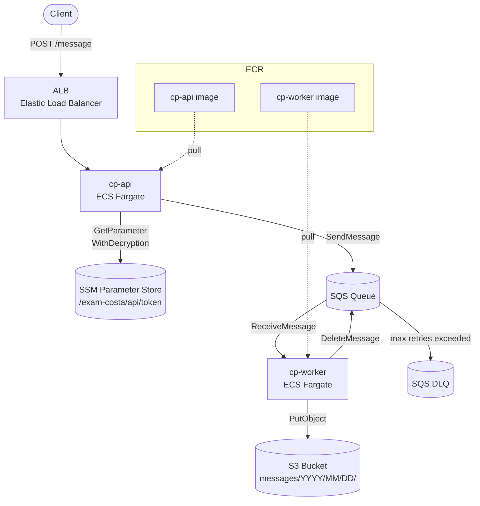
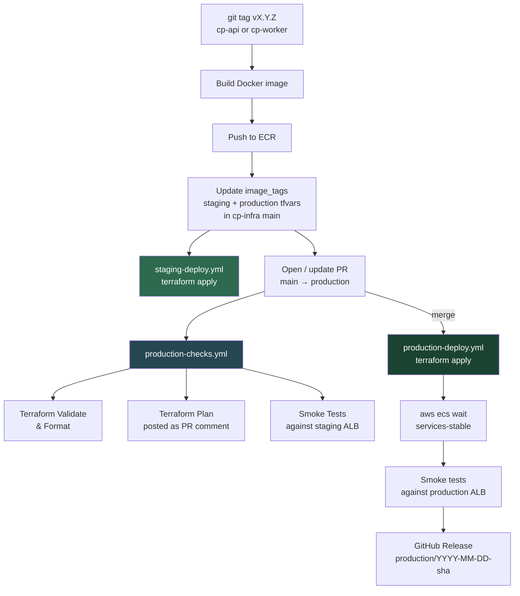
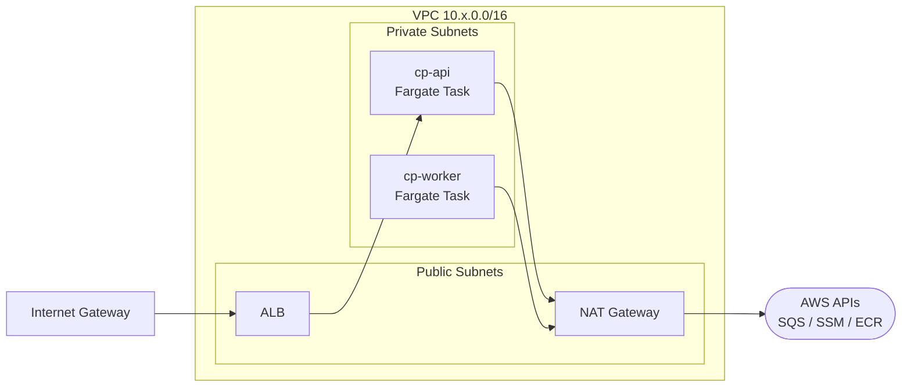
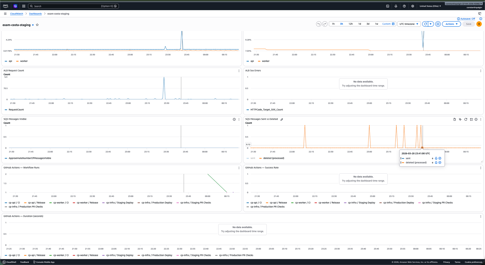
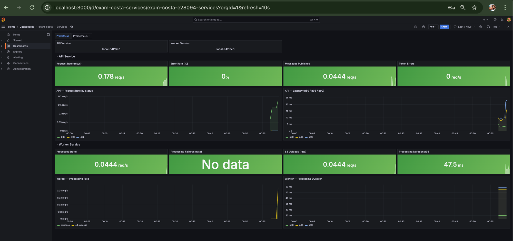
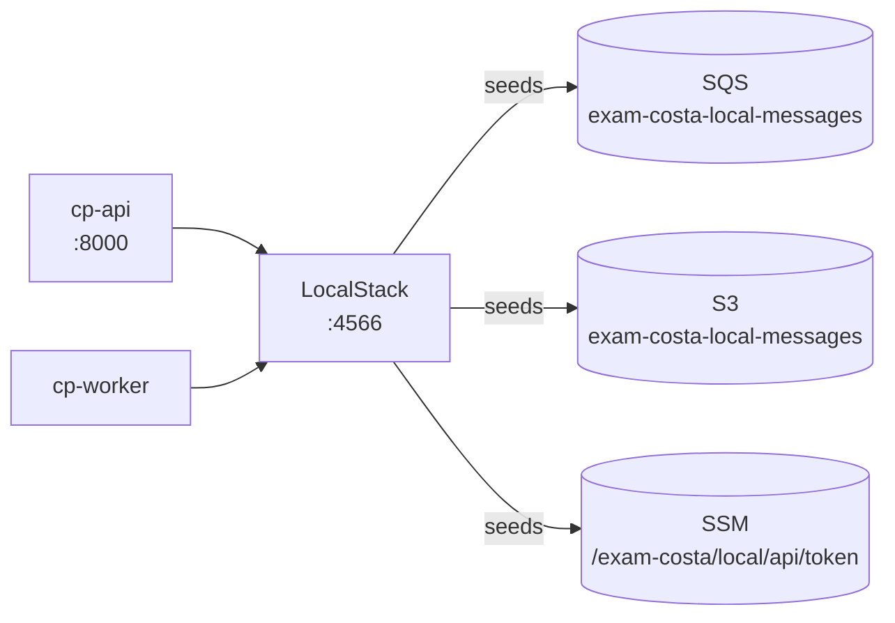

# cp-infra


Terraform infrastructure, local development stack, and CI/CD orchestration for the DevOps Exam — Costa Paigin.

---

## Repositories

| Repo | Description |
|------|-------------|
| [`cp-api`](https://github.com/cp-koss110/cp-api) | REST API — receives requests, validates token, publishes to SQS |
| [`cp-worker`](https://github.com/cp-koss110/cp-worker) | Background worker — polls SQS, uploads messages to S3 |
| [`cp-infra`](https://github.com/cp-koss110/cp-infra) | This repo — Terraform IaC + local stack + CI/CD workflows |

---

## System architecture



---

## CI/CD pipeline



### Branch strategy

| Branch | Environment | Trigger |
|--------|------------|---------|
| `main` | Staging | Push to `main` with `iac/**` changes |
| `production` | Production | PR merged from `main` |

---

## Infrastructure overview



| Resource | Staging | Production |
|----------|---------|------------|
| ECS CPU | 256 (0.25 vCPU) | 256 (0.25 vCPU) |
| ECS Memory | 512 MB | 512 MB |
| NAT Gateways | 1 | 1 |
| S3 force-destroy | yes | no |
| Log retention | 7 days | 30 days |
| ECR tag mutability | MUTABLE | IMMUTABLE |
| Container Insights | enabled | enabled |
| CloudWatch dashboard | enabled | enabled |
| CloudWatch alarms | enabled | enabled |

---

## Terraform state

| Environment | S3 key |
|-------------|--------|
| Staging | `envs/eus2/staging/terraform.tfstate` |
| Production | `envs/eus2/production/terraform.tfstate` |

State bucket: `exam-costa-terraform-state`
Lock table: `exam-costa-terraform-locks`

---

## Monitoring

### CloudWatch dashboard (AWS)

A per-environment CloudWatch dashboard is provisioned automatically by Terraform. It tracks ECS CPU/memory utilisation, ALB request count and 5xx errors, SQS messages visible and sent/deleted, and GitHub Actions workflow runs + success rate.



### Grafana dashboard (local)

A local Grafana + Prometheus stack ships with the repo (`make local-monitoring-up`). It surfaces per-service application metrics exported directly from cp-api and cp-worker:

| Panel | What it shows |
|-------|--------------|
| API — Request Rate by Status | HTTP 200 / 401 / 422 breakdown |
| API — Latency p50/p95/p99 | End-to-end response time percentiles |
| API — Messages Published | Rate of SQS publishes |
| API — Token Errors | Rate of 401 rejections |
| Worker — Processed / S3 Uploads | Rate of messages consumed and uploaded |
| Worker — Processing Duration p95 | Time to process each SQS message |



---

## Local development

### Prerequisites

- Docker + Docker Compose
- `make`
- AWS CLI (for inspecting LocalStack resources)

### Repo layout (siblings required)

```
parent-dir/
├── cp-infra/    ← this repo
├── cp-api/
└── cp-worker/
```

### Full local stack quickstart



```bash
# Clone all three repos as siblings
git clone https://github.com/cp-koss110/cp-infra
git clone https://github.com/cp-koss110/cp-api
git clone https://github.com/cp-koss110/cp-worker

cd cp-infra

# 1. Start LocalStack and seed AWS resources
make local-up

# 2. Build images and start the full stack (api + worker + localstack)
make local-build
```

**Verify:**
```bash
curl http://localhost:8000/healthz
# {"status":"healthy","service":"api","version":"local-<sha>"}
```

**Send a test message:**
```bash
curl -s -X POST http://localhost:8000/message \
  -H "Content-Type: application/json" \
  -d '{
    "data": {
      "email_subject": "Happy new year!",
      "email_sender": "John Doe",
      "email_timestream": "1693561101",
      "email_content": "Just want to say... Happy new year!!!"
    },
    "token": "local-dev-token"
  }' | python3 -m json.tool
```

**Verify the worker uploaded it to S3:**
```bash
aws --endpoint-url=http://localhost:4566 --region us-east-2 \
  s3 ls s3://exam-costa-local-messages/messages/ --recursive
```

**Tear down:**
```bash
make local-down
```

### Local monitoring (optional)

Start an independent Prometheus + Grafana + Node Exporter stack:

```bash
make local-monitoring-up
```

| Service | URL |
|---------|-----|
| Grafana | http://localhost:3000 — login: `admin` / `admin` |
| Prometheus | http://localhost:9090 |
| Node Exporter | http://localhost:9100/metrics |

Grafana starts with the Prometheus datasource pre-configured. To get a full system dashboard: **Dashboards → Import → ID `1860`** (Node Exporter Full).

```bash
make local-monitoring-down   # stop + remove volumes
```

---

## Make targets reference

### Bootstrap

| Target | Description |
|--------|-------------|
| `make bootstrap` | Create state bucket, ECR repos, DynamoDB lock table and write API token to SSM. Reads `API_TOKEN` from env var → `.env` file → interactive prompt (suggests `openssl rand -hex 32`) |

### Local stack

| Target | Description |
|--------|-------------|
| `make local-up` | Start LocalStack + seed SQS, S3, SSM (no app build) |
| `make local-build` | Build cp-api and cp-worker images + start full stack |
| `make local-down` | Stop all containers and remove volumes |
| `make local-logs` | Follow logs for all containers |
| `make logs-api` | Follow cp-api container logs |
| `make logs-worker` | Follow cp-worker container logs |
| `make logs-localstack` | Follow LocalStack container logs |

### Local monitoring (optional)

| Target | Description |
|--------|-------------|
| `make local-monitoring-up` | Start Prometheus + Grafana + Node Exporter |
| `make local-monitoring-down` | Stop monitoring stack and remove volumes |

### Tests

| Target | Description |
|--------|-------------|
| `make app-test` | Unit tests for both services (with coverage) |
| `make app-test-unit` | Same as `app-test` |
| `make app-test-integration` | Integration tests — requires `LOCALSTACK_ENDPOINT=http://localhost:4566` |
| `make test-validate` | `terraform fmt -check` + `terraform validate` across all modules |
| `make install-e2e` | Create `iac/tests/e2e/.venv` and install test dependencies |
| `make test-e2e` | Smoke tests against staging — ALB URL, API token, S3 bucket auto-fetched from SSM |
| `make test-e2e ENV=production` | Same against production |
| `make test-e2e ALB_URL=http://...` | Manual ALB override |

### Terraform

| Target | Description |
|--------|-------------|
| `make tf-init` | `terraform init` with S3 backend (requires local `backend.hcl`) |
| `make tf-plan-staging` | Plan staging with `staging.tfvars` + `image_tags.staging.tfvars` |
| `make tf-apply-staging` | Apply staging (auto-approve) |
| `make tf-plan-production` | Plan production with `production.tfvars` + `image_tags.production.tfvars` |
| `make tf-apply-production` | Apply production (auto-approve) |

### GitHub

| Target | Description |
|--------|-------------|
| `make branch-protection` | Apply branch protection rules to all 3 repos |
| `make branch-protection-production` | Apply protection to `cp-infra/production` only |

### Nuke (destructive)

| Target | Description |
|--------|-------------|
| `make nuke-staging` | `terraform destroy` the staging environment |
| `make nuke-production` | `terraform destroy` the production environment |
| `make nuke-bootstrap` | Destroy ECR repos, state bucket, DynamoDB + delete API token from SSM |
| `make nuke-all` | Destroy everything — prompts for confirmation |

> `TF_BACKEND_BUCKET` and `TF_LOCK_TABLE` can be overridden via env var or `.env` file. Defaults to `exam-costa-terraform-state` / `exam-costa-terraform-locks`.

---

## Pre-commit hooks

### cp-infra (this repo)

Hooks run on every commit:

| Hook | What it checks |
|------|---------------|
| `trailing-whitespace` | No trailing whitespace |
| `end-of-file-fixer` | Files end with a newline |
| `check-yaml` | Valid YAML syntax |
| `check-json` | Valid JSON syntax |
| `check-merge-conflict` | No leftover conflict markers |
| `check-added-large-files` | No files > 500 KB |
| `terraform_fmt` | All `.tf` files are formatted (`terraform fmt`) |
| `detect-secrets` | No hardcoded secrets (`.tfvars` and lock files excluded) |

**Setup:**
```bash
pip install pre-commit==3.7.1
pre-commit install
```

**Run manually:**
```bash
pre-commit run --all-files
```

### cp-api / cp-worker

Additional hooks in the service repos:

| Hook | What it checks |
|------|---------------|
| `ruff` | Python lint |
| `ruff-format` | Python formatting |
| `unit tests (fast)` | Runs unit tests on every Python file commit |

**Setup (per service repo):**
```bash
make pre-commit-install   # installs hooks into .git/hooks
```

**Run manually:**
```bash
make pre-commit-run       # runs all hooks against all files
```

---

## First-time AWS deployment

### 1. Bootstrap

```bash
cd cp-infra
API_TOKEN=$(openssl rand -hex 32) make bootstrap
```

Bootstraps:
- S3 state bucket (`exam-costa-terraform-state`)
- DynamoDB lock table (`exam-costa-terraform-locks`)
- ECR repositories (`exam-costa-api`, `exam-costa-worker`)
- SSM SecureStrings at `/exam-costa/staging/api/token` and `/exam-costa/production/api/token`

### 2. Configure GitHub Actions secrets

Add these 4 secrets to **all three repos** (cp-api, cp-worker, cp-infra):

| Secret | Description |
|--------|-------------|
| `AWS_ACCESS_KEY_ID` | IAM access key |
| `AWS_SECRET_ACCESS_KEY` | IAM secret key |
| `INFRA_REPO_TOKEN` | Fine-grained PAT — cp-infra: **Contents** (read/write) + **Pull requests** (read/write) + **Workflows** (read/write) |
| `INFRA_REPO` | `cp-koss110/cp-infra` |

### 3. Push a tag to deploy

```bash
cd cp-api   && git tag v1.0.0 && git push --tags
cd cp-worker && git tag v1.0.0 && git push --tags
```

Staging deploys automatically. A PR to `production` is opened automatically.

### 4. Apply branch protection

```bash
cd cp-infra && make branch-protection
```

---

## Project structure

```
cp-infra/
├── iac/
│   ├── bootstrap/              # Run once — state bucket, ECR, lock table
│   ├── terraform/
│   │   ├── envs/eus2/          # Environment config
│   │   │   ├── main.tf
│   │   │   ├── variables.tf
│   │   │   ├── outputs.tf
│   │   │   ├── staging.tfvars
│   │   │   ├── production.tfvars
│   │   │   ├── image_tags.staging.tfvars       # managed by GitHub Actions
│   │   │   └── image_tags.production.tfvars    # managed by GitHub Actions
│   │   └── modules/
│   │       ├── network/        # VPC, subnets, NAT, IGW
│   │       ├── alb/            # Load balancer + target group
│   │       ├── ecs_cluster/    # ECS cluster
│   │       ├── ecs_service/    # ECS task definition + service
│   │       ├── sqs/            # Queue + DLQ
│   │       ├── s3/             # Messages bucket
│   │       ├── iam/            # Execution + task roles
│   │       └── ssm_parameter/  # SSM parameter wrapper
│   └── tests/
│       ├── terraform/          # validate.sh — fmt-check + validate
│       └── e2e/                # test_smoke.py — HTTP smoke tests
├── local/
│   ├── docker-compose.yml           # Full local stack (api + worker + localstack)
│   ├── docker-compose.monitoring.yml # Optional monitoring stack (prometheus + grafana + node-exporter)
│   ├── monitoring/
│   │   ├── prometheus.yml           # Prometheus scrape config
│   │   └── grafana/provisioning/    # Grafana datasource auto-provisioning
│   └── scripts/
│       └── bootstrap-local.sh       # Seeds LocalStack
├── scripts/
│   └── apply-branch-protection.sh
└── Makefile
```

---

## Live environments

All runtime endpoints are stored in SSM Parameter Store after each `terraform apply`. Retrieve them with:

```bash
# Staging
aws ssm get-parameter --name /exam-costa/staging/outputs/alb_url                    --query Parameter.Value --output text
aws ssm get-parameter --name /exam-costa/staging/outputs/cloudwatch_dashboard_url   --query Parameter.Value --output text

# Production
aws ssm get-parameter --name /exam-costa/production/outputs/alb_url                 --query Parameter.Value --output text
aws ssm get-parameter --name /exam-costa/production/outputs/cloudwatch_dashboard_url --query Parameter.Value --output text
```

| SSM path | Description |
|----------|-------------|
| `/exam-costa/{env}/outputs/alb_url` | ALB endpoint for the API |
| `/exam-costa/{env}/outputs/cloudwatch_dashboard_url` | CloudWatch dashboard link |
| `/exam-costa/{env}/outputs/sqs_queue_url` | SQS queue URL |
| `/exam-costa/{env}/outputs/s3_bucket_name` | S3 messages bucket |
| `/exam-costa/{env}/outputs/ecs_cluster_name` | ECS cluster name |
| `/exam-costa/{env}/outputs/api_service_name` | ECS API service name |
| `/exam-costa/{env}/outputs/worker_service_name` | ECS worker service name |
| `/exam-costa/{env}/api/token` | API bearer token (SecureString) |

`{env}` is `staging` or `production`.
